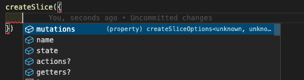
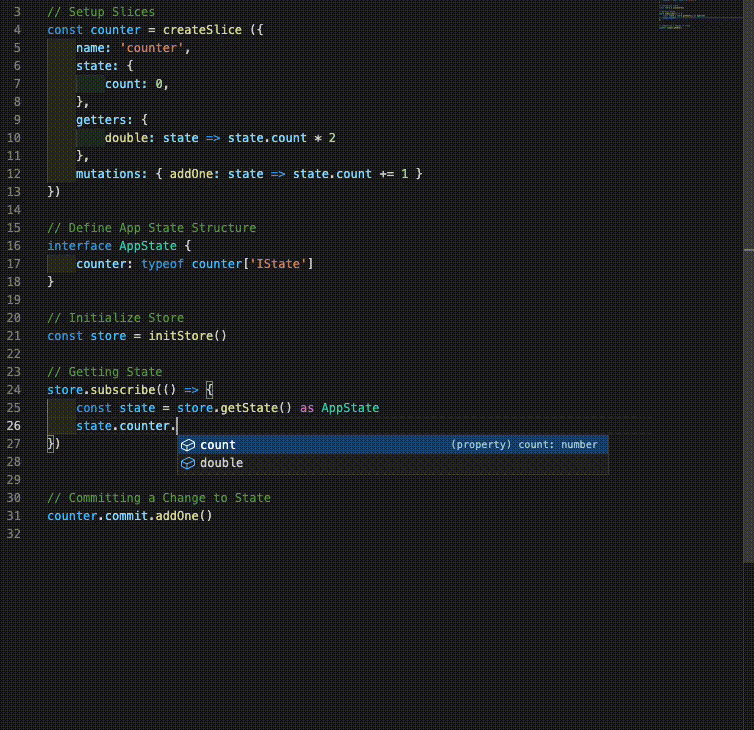
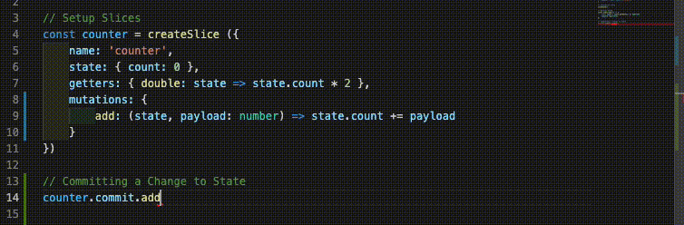

# RedVue
RedVue is the Redux toolkit in a Style inspired by Vuex with heavy TypeScript Support.

## Quick Start

### Installing what you need
```bash
npm install -g npx
npm install redvue ts-node
```

### TypeScript File

index.ts

```ts
import { createSlice, initStore} from 'redvue'

// Setup Slices
const counter = createSlice ({
    name: 'counter',
    state: { count: 0 },
    getters: { double: state => state.count * 2 },
    mutations: { addOne: state => state.count += 1 }
})

// Define App State Structure 
interface AppState {
    counter: typeof counter['IState']
}

// Initialize Store
const store = initStore()

// Getting State
store.subscribe(() => {
    const state = store.getState() as AppState
    console.log(state)
})

// Committing a Change to State
counter.commit.addOne()
```

### Run It

```bash
npx ts-node index.ts
```

### Output

```bash
{ counter: { count: 1, double: 2 } }
```

# The Parts of Redvue

Redvue is the Redux toolkit with the flavor of Vuex with heavy Typescript support.

There are three major parts of the store. The Store itself, Slices of the store, and Middleware.

## The Store

This is where you configure the store and set if you want the Redux Devtools enabled or middleware added.

```ts
const Store = configureStore({
  middleware: [middleware()],
  devTools: false
})
```

### middleware
An Array of middleware functions that fire after each action.

### devTools
This is a boolean value to enable the [Redux devtools](https://github.com/zalmoxisus/redux-devtools-extension).


## Slice

Slices are where you declare state and how you interact with the state.

```ts

interface product {
    stockcode: number,
    productname: string
}
// Setup Slices
const myStore = createSlice ({
    name: 'store', // Name of the slice
    state: { // The initial state
      products: [] as product[],
      sortBy: 'price'
    },
    getters: { // State values that change when a mutation is fired.
      filteredProducts (state) {
        const key = state.sortBy
        return state.products.sort((a,b) => a[key] - b[key])
      }
    },
    mutations: { // This is the only location changes to the state occur.
      addProducts (state, payload:product) {
        state.products.push(payload);
      }
    },
    actions: { // This is where you can do async calls
      getProducts () {
        fetch('/api/getProducts/')
        .then(res => res.json())
        .then(products => myStore.commit.addProducts(products))
      }
    }
  })

```

#### State
This is the initial value of the state.
#### Getters
In this case whenever any of the mutations fire
for this slice the filteredProducts function is ran
and a value call filteredProducts is appended to the
state object with the returned value of this function.

So all that needs to be done is change sortBy to name
and the filteredProducts will auto calculate the filtered
values to be sorted by name vs price.
#### Mutations
These are functions that change state.
Unlike Redux you can mutate the state like Vuex
#### Actions
These are just functions that can dispatch mutations at any time to handle async tasks like fetching an API.


## Middleware
Events that will trigger after each action and be given the Redux action signature.

### Example

#### Creation
```ts
// middleware/log file
import { logAction } from 'logSlice';
import { middleware } from 'RedVue';

export const logMiddleware = middleware((action) => {
  // So it won't trigger itself
  if (action.type !== 'log/insertLog') {
    // Log the Action
    logAction.commit.insertLog({
        timestamp: new Date(),
        action: action.type,
        payload: action.payload
    })
  }
})
```

#### Registering
```ts
// Store file
import {log} from 'middleware/log'

configureStore({
  middleware: [log],
  devTools: false
})
```


## TypeScript Support

There are three major areas of TypeScript Support. Inside the slice, reading from the state, and interactions (actions and mutations).

### Slices

When you create a slice as long as you are within the function itself the getters and mutations will know the state structure automatically.



### Reading the State

The `createSlice` function return a IState object that you can get the state structure from. All you need to do is create a master state interface "AppState" and assign that to the output of `state.getState()` and all your state structure and getters will come along with it.



### Interactions (Actions and Mutations)

The createSlice function returns the actions and commits which is how you run the mutations. As the function already knows what you entered into the function it will type check all the inputs for you.



# Examples

In the Repo we have a Examples in the examples folder check them out.
